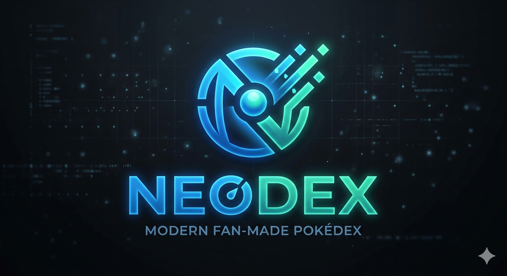

# 🎮 NeoDex - Modern Pokédex Website

A visually stunning, feature-rich Pokédex web application built with **Node.js**, **Express.js**, and the **PokeAPI**. Browse, search, and explore Pokémon with an immersive dark-mode UI featuring glassmorphism design and smooth animations.

## ✨ Features

### Core Features
- 🎯 **Browse Pokédex**: Explore 500+ Pokémon with detailed information
- 🔍 **Advanced Search**: Search Pokémon by name or ID
- 🏷️ **Type Filtering**: Filter Pokémon by their elemental type
- 📊 **Sorting Options**: Sort by Pokédex number, name, or base stats
- ⭐ **Favorites System**: Save your favorite Pokémon to local storage
- 📱 **Responsive Design**: Fully optimized for mobile, tablet, and desktop
- ⚡ **Fast Loading**: In-memory caching for optimal performance
- 🎨 **Beautiful UI**: Dark mode with glassmorphism and neon accents

### Pokémon Detail View
- 🖼️ **Official Artwork**: High-quality Pokémon images
- 📈 **Base Stats**: Detailed stat breakdown with animated progress bars
- 🏷️ **Type Badges**: Color-coded type indicators
- 📏 **Physical Attributes**: Height and weight information
- 🎯 **Abilities**: Main and hidden abilities display
- 🔢 **Pokédex ID**: Official Pokémon identification number

## 🛠️ Tech Stack

- **Backend**: Node.js, Express.js
- **Frontend**: HTML5, CSS3, Vanilla JavaScript
- **Template Engine**: EJS
- **API**: PokeAPI (REST)
- **Styling**: Custom CSS with glassmorphism effects
- **Data Management**: In-memory caching
- **Storage**: Browser LocalStorage (for favorites)

## 📦 Installation

### Prerequisites
- Node.js (v14 or higher)
- npm (v6 or higher)

### Setup Steps

1. **Clone the repository**
   ```bash
   git clone https://github.com/RelayDevloper/NeoDex.git
   cd NeoDex
   ```

2. **Install dependencies**
   ```bash
   npm install
   ```

3. **Start the development server**
   ```bash
   npm run dev
   ```
   Or for production:
   ```bash
   npm start
   ```

4. **Open in browser**
   ```
   http://localhost:3000
   ```

## 🚀 How to Run Locally

### Development Mode (with auto-reload)
```bash
npm run dev
```
This uses `nodemon` to automatically restart the server when files change.

### Production Mode
```bash
npm start
```

## 📁 Project Structure

```
NeoDex/
├── app.js                 # Main Express application
├── package.json           # Project dependencies
├── public/
│   ├── css/
│   │   └── styles.css     # Main stylesheet with dark theme
│   └── js/
│       └── app.js         # Client-side JavaScript
├── views/
│   └── index.ejs          # Main EJS template
├── routes/
│   └── pokemon.js         # API routes
├── services/
│   └── pokeapi.js         # PokeAPI service layer
└── README.md              # This file
```

## 🔌 API Endpoints

### REST API Endpoints

**Base URL**: `http://localhost:3000/api/pokemon`

| Endpoint | Method | Description |
|----------|--------|-------------|
| `/list` | GET | Get paginated list of Pokémon |
| `/:id` | GET | Get specific Pokémon details |
| `/search/:query` | GET | Search Pokémon by name or ID |
| `/type/:type` | GET | Get Pokémon filtered by type |
| `/types/all` | GET | Get all available Pokémon types |

### Example Requests

```bash
# Get list of Pokémon (first 20)
curl http://localhost:3000/api/pokemon/list?limit=20&offset=0

# Get specific Pokémon
curl http://localhost:3000/api/pokemon/25

# Search for a Pokémon
curl http://localhost:3000/api/pokemon/search/pikachu

# Filter by type
curl http://localhost:3000/api/pokemon/type/fire

# Get all types
curl http://localhost:3000/api/pokemon/types/all
```

## 🎨 UI/UX Highlights

### Design Features
- **Dark Mode**: Easy on the eyes with a professional dark theme
- **Glassmorphism**: Frosted glass effect on cards and modals
- **Smooth Animations**: Hover effects and transitions
- **Type Color Coding**: Each Pokémon type has its unique color
- **Responsive Grid**: Adapts to different screen sizes
- **Loading States**: Skeleton loaders while fetching data

### Color Scheme
- **Primary**: Indigo (`#6366f1`)
- **Secondary**: Purple (`#8b5cf6`)
- **Accent**: Pink (`#ec4899`)
- **Background**: Deep Navy (`#0f172a`)
- **Cards**: Glassmorphic (`rgba(30, 41, 59, 0.6)`)

## 🌟 Key Functionality

### Search & Discovery
- Real-time search filtering
- Type-based filtering
- Multiple sorting options
- Fast pagination

### Data Management
- In-memory caching for better performance
- Centralized API service layer
- Error handling for failed API requests
- Graceful fallbacks

### User Experience
- Favorite Pokémon with local storage persistence
- Modal detail view for deep exploration
- Smooth page transitions
- Responsive design for all devices

## 🚫 Error Handling

The application includes comprehensive error handling:
- Network error messages
- Invalid Pokémon lookup
- Graceful degradation
- User-friendly error messages

## 💾 Local Storage

The application uses browser LocalStorage to save:
- **Favorite Pokémon IDs**: Persists across sessions

Clear favorites:
```javascript
localStorage.removeItem('neodex-favorites')
```

## 🔄 Data Caching

The backend implements in-memory caching for:
- Individual Pokémon data
- Type information
- Species data

This significantly reduces API calls and improves response times.

## 📊 Performance

- **Initial Load**: ~2-3 seconds (depends on connection)
- **Pagination**: Instant
- **Search**: Real-time filtering
- **API Calls**: Minimized with caching

## 🐛 Known Limitations

- Loads up to 500 Pokémon for balance between completeness and performance
- In-memory cache is not persistent (resets on server restart)
- Some Pokémon generations may have missing images

## 🔮 Future Improvements

- [x] Infinite scroll pagination
- [x] Shiny Pokémon toggle
- [x] Evolution chain visualization
- [ ] Make The Loading Time Fast
- [ ] Move list and learnsets
- [ ] Pokémon comparisons
- [ ] Generation-based filtering
- [ ] Advanced filtering (by stats, generation)
- [ ] Dark/Light theme toggle
- [ ] Pokémon sound effects
- [ ] Database persistence (MongoDB/PostgreSQL)
- [ ] User authentication
- [ ] Trading/battling features
- [ ] PWA (Progressive Web App) support

## 📄 License

This project is licensed under the MIT License - see the [LICENSE](LICENSE) file for details.

## ⚖️ Disclaimer

**This project is a fan-made, non-commercial application created for educational and portfolio purposes only.**

Pokémon and Pokémon character names are trademarks of Nintendo, Game Freak, and The Pokémon Company.

**This project is not affiliated with, endorsed by, sponsored by, or approved by Nintendo, Game Freak, or The Pokémon Company.**

All Pokémon data and images are provided by the public PokeAPI (pokeapi.co).

## 📚 Resources

- **PokeAPI Documentation**: https://pokeapi.co/docs/v2
- **Node.js Documentation**: https://nodejs.org/docs/
- **Express.js Documentation**: https://expressjs.com/
- **EJS Documentation**: https://ejs.co/

## 🤝 Contributing

Contributions are welcome! Please feel free to submit a Pull Request.

## 👨‍💻 Author

**NeoDex Development Team**

---

**Made with ❤️ for Pokémon fans and developers everywhere.**
